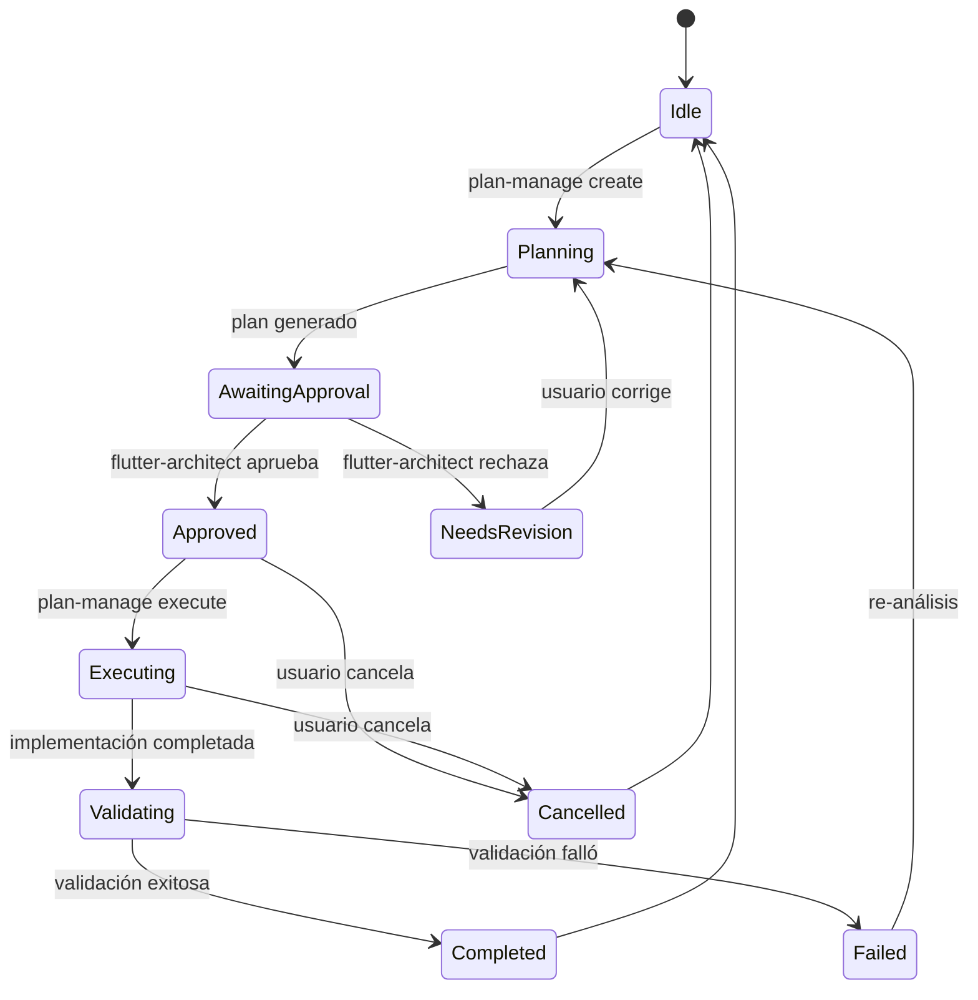

# Comando: Plan Manager

## Objetivo

Orquestar el ciclo de vida completo de planes técnicos en el proyecto FitPulse Interval Timer. Este comando meta es el **único autorizado** para:

- **Crear planes**: Coordinar agentes de planificación para generar estrategias técnicas
- **Aprobar planes**: Gestionar el flujo de aprobación antes de ejecución
- **Ejecutar planes**: Coordinar la implementación de planes aprobados
- **Validar resultados**: Verificar que la ejecución cumpla criterios de aceptación
- **Gestionar estado**: Trackear planes pendientes, en ejecución y completados

**No modifica código directamente**, sino que coordina commands y agentes especializados.

## Contexto Requerido del Usuario

- [ ] Acción deseada: create, approve, execute, validate, list o cancel
- [ ] ID del plan (si aplica): existing-plan-id o nuevo
- [ ] Descripción de la tarea (para create): feature, refactor, fix, etc.
- [ ] Prioridad: crítica, alta, media, baja
- [ ] Restricciones técnicas (opcional): stack, compatibilidad, deadline
- [ ] Criterios de aceptación (para execute): qué define "completado"

## Análisis Inicial (Obligatorio)

Antes de cualquier acción, el command debe evaluar:

- **Estado actual**: ¿Existen planes pendientes? ¿Hay conflictos?
- **Acción solicitada**: ¿Es válida en el estado actual?
- **Dependencias**: ¿Qué commands/agentes se necesitan?
- **Riesgos**: ¿Puede afectar planes en curso?
- **Recursos**: ¿Hay agentes disponibles?

### Pre-ejecución: Checklist Obligatorio

```json
{
  "validation_passed": true,
  "current_state": "idle | planning | awaiting_approval | executing | validating",
  "pending_plans": ["20250120-143022-feature-planner.md"],
  "active_plan": "20250120-120000-training-screen.md",
  "risks": ["Modifica TimerService - componente crítico"],
  "blocking_issues": [],
  "required_agents": ["flutter-planning-agent", "flutter-developer"],
  "estimated_duration": "2-4 horas"
}
```

## Selección de Agentes y Skills

### Fase 1: Creación de Plan

```yaml
responsible: flutter-planning-agent
accountable: flutter-architect
consulted: [ technical-writer, code-reviewer ]
informed: [ flutter-orchestrator ]
```

**Justificación**: 
- `flutter-planning-agent`: Especializado en razonamiento arquitectónico Flutter
- `flutter-architect`: Valida decisions estructurales
- `technical-writer`: Documenta plan claramente
- `code-reviewer`: Verifica calidad del plan

### Fase 2: Aprobación

```yaml
responsible: flutter-architect
accountable: flutter-orchestrator
consulted: [ code-reviewer ]
informed: [ flutter-developer ]
```

**Justificación**:
- `flutter-architect`: Evalúa impacto arquitectónico
- `flutter-orchestrator`: Coordina decisión final
- `code-reviewer`: Valida calidad técnica

### Fase 3: Ejecución

```yaml
responsible: flutter-developer
accountable: flutter-orchestrator
consulted: [ flutter-testing, performance-optimizer ]
informed: [ test-coverage-analyzer ]
```

**Justificación**:
- `flutter-developer`: Implementa con Clean Architecture + Riverpod
- `flutter-testing`: Asegura cobertura >70%
- `performance-optimizer`: Verifica eficiencia (battery, memory)
- `test-coverage-analyzer`: Trackea métricas de cobertura

### Fase 4: Validación

```yaml
responsible: test-coverage-analyzer
accountable: flutter-architect
consulted: [ code-reviewer, debugger-specialist ]
informed: [ flutter-orchestrator ]
```

**Justificación**:
- `test-coverage-analyzer`: Valida cobertura de tests
- `code-reviewer`: Revisa calidad de código
- `debugger-specialist**: Verifica ausencia de bugs críticos
- `flutter-architect`: Aprueba arquitectura final

## Flujo de Trabajo Orquestado

### 1. Crear Plan (flutter-planning-agent | Validado por flutter-architect)

**Objetivo**: Analizar solicitud y generar plan técnico estructurado

**Tareas**:

- Analizar requerimiento del usuario
- Evaluar impacto en arquitectura existente
- Seleccionar command de planificación adecuado (feature-planner, refactor-analyzer, etc.)
- Generar plan en `.claude/plans/{timestamp}-{command-name}.md`
- Documentar fases, responsables y criterios de aceptación

**Asignación**:

- **Agente**: flutter-planning-agent
- **Skills**: `technical-writer`, `code-reviewer`
- **Commands invocados**: feature-planner, refactor-analyzer (según corresponda)
- **Validador**: flutter-architect

**Criterios de Salida**:

- [ ] Plan generado en ubicación correcta
- [ ] Fases numeradas con responsables RACI
- [ ] Criterios de aceptación verificables
- [ ] Análisis de riesgos completado
- [ ] Plan marcado como "pending_approval"

---

### 2. Aprobar Plan (flutter-architect | Validado por flutter-orchestrator)

**Objetivo**: Revisar plan y aprobar para ejecución

**Tareas**:

- Leer plan generado en `.claude/plans/`
- Validar que cumple estándares de FitPulse
- Verificar impacto en componentes críticos (TimerService, AudioService, BackgroundService)
- Consultar con equipo si hay riesgos altos
- Cambiar estado a "approved" o "needs_revision"

**Asignación**:

- **Agente**: flutter-architect
- **Skills**: `code-reviewer`
- **Dependencias**: Fase 1 completada
- **Validador**: flutter-orchestrator

**Criterios de Salida**:

- [ ] Plan revisado completamente
- [ ] Riesgos documentados y mitigados
- [ ] Estado actualizado en metadata del plan
- [ ] Notificación de decisión al usuario

---

### 3. Ejecutar Plan (flutter-developer | Validado por flutter-orchestrator)

**Objetivo**: Implementar cambios según plan aprobado

**Tareas**:

- Leer plan aprobado
- Ejecutar fases secuencialmente
- Coordinar con agentes especializados (audio-system-specialist si aplica, background-execution-expert si aplica)
- Ejecutar tests unitarios e integración
- Verificar cobertura >70%
- Actualizar estado del plan a "executing"

**Asignación**:

- **Agente**: flutter-developer
- **Skills**: `flutter-testing`, `performance-optimizer`
- **MCPs**: chrome-devtools (para testing UI), web-reader (para documentación)
- **Dependencias**: Fase 2 completada (plan aprobado)
- **Validador**: flutter-orchestrator

**Criterios de Salida**:

- [ ] Todas las fases ejecutadas
- [ ] Tests pasando (unit + widget + integration)
- [ ] Cobertura >70% en código modificado
- [ ] `flutter analyze` sin warnings
- [ ] Código probado en dispositivo real

---

### 4. Validar Resultados (test-coverage-analyzer | Validado por flutter-architect)

**Objetivo**: Verificar que la implementación cumpla criterios de aceptación

**Tareas**:

- Ejecutar suite completa de tests
- Verificar cobertura de código
- Revisar código con code-reviewer
- Validar que no haya regresiones
- Verificar performance en dispositivo real (timer drift, background audio, battery)
- Marcar plan como "completed" o "failed"

**Asignación**:

- **Agente**: test-coverage-analyzer
- **Skills**: `code-reviewer`, `debugger-specialist`
- **Dependencias**: Fase 3 completada
- **Validador**: flutter-architect

**Criterios de Salida**:

- [ ] Todos los tests pasando
- [ ] Cobertura >70% mantenida o mejorada
- [ ] Cero warnings en `flutter analyze`
- [ ] Validación en dispositivo real completada
- [ ] Plan marcado como "completed"
- [ ] Log de ejecución guardado en `.claude/logs/`

---

### 5. Gestionar Estado (flutter-orchestrator | Validado por flutter-architect)

**Objetivo**: Mantener registro centralizado de todos los planes

**Tareas**:

- Listar planes en `.claude/plans/`
- Mostrar estado actual de cada plan
- Permitir cancelar planes en curso
- Permitir reactivar planes cancelados
- Generar reportes de progreso

**Asignación**:

- **Agente**: flutter-orchestrator
- **Skills**: `technical-writer`
- **Validador**: flutter-architect

**Criterios de Salida**:

- [ ] Estado global del proyecto actualizado
- [ ] Reporte de planes pendientes disponible
- [ ] Historial de ejecución mantenido

## Uso de otros Commands y MCPs

```yaml
commands_invocados:
  - name: feature-planner
    trigger: fase-1-create
    condition: tipo de tarea = nueva funcionalidad
    
  - name: refactor-analyzer
    trigger: fase-1-create
    condition: tipo de tarea = refactorización
    
  - name: bug-fix-planner
    trigger: fase-1-create
    condition: tipo de tarea = corrección de bugs

mcps_utilizados:
  - name: chrome-devtools
    purpose: Testing de UI en navegador (si aplica web)
    
  - name: web-reader
    purpose: Consultar documentación oficial Flutter/Dart

contexto_compartido:
  location: .claude/context/plan-state.json
  format: JSON
  consumers: [ feature-planner, refactor-analyzer, test-coordinator ]
```

**Formato de estado compartido**:

```json
{
  "active_plans": [
    {
      "id": "20250120-143022-feature-planner",
      "name": "Implementar pantalla de entrenamiento",
      "status": "executing",
      "priority": "high",
      "created_at": "2025-01-20T14:30:22Z",
      "approved_at": "2025-01-20T15:00:00Z"
    }
  ],
  "completed_plans": [
    {
      "id": "20250119-100000-audio-service",
      "name": "Configurar AudioService con just_audio",
      "status": "completed",
      "completed_at": "2025-01-19T16:30:00Z"
    }
  ],
  "pending_approval": []
}
```

## Output y Artefactos

| Artefacto                | Ubicación                                     | Formato    | Validador            | Obligatorio |
|--------------------------|-----------------------------------------------|------------|----------------------|-------------|
| Plan técnico             | `.claude/plans/{timestamp}-{command}.md`      | Markdown   | flutter-architect    | Sí          |
| Estado global            | `.claude/context/plan-state.json`             | JSON       | flutter-orchestrator | Sí          |
| Log de ejecución         | `.claude/logs/plan-manage-{date}.log`         | Plain text | -                    | Sí          |
| Reporte de validación    | `.claude/reports/validation-{plan-id}.md`     | Markdown   | test-coverage-analyzer | Sí        |
| Métricas de cobertura    | `.claude/reports/coverage-{plan-id}.json`     | JSON       | test-coverage-analyzer | Sí        |

## Rollback y Cancelación

Si el usuario cancela o falla una ejecución:

### Procedimiento de Cancelación

1. **Detener ejecución en curso**:
   - Enviar señal de cancelación al agente activo
   - Marcar plan actual como "cancelled"

2. **Snapshot del estado**:
   - Guardar progreso actual en `.claude/temp/{plan-id}-snapshot.json`
   - Registrar cambios parciales realizados

3. **Limpieza segura**:
   - Si es fase de ejecución: dejar código parcial (no revertir git)
   - Documentar qué quedó pendiente
   - Crear plan de continuación

4. **Revertir estado compartido**:
   - Restaurar `.claude/context/plan-state.json` a versión anterior
   - Remover plan de lista "active_plans"

5. **Registro**:
   ```
   .claude/logs/cancelled-{timestamp}.log
   Plan ID: {plan-id}
   Fase: {fase en curso}
   Motivo: {user_cancelled | execution_failed | blocked}
   Progreso: {fases completadas}/{total fases}
   ```

6. **Notificación**:
   - Informar al usuario del estado de cancelación
   - Ofrecer opciones: reintentar, continuar desde snapshot, o descartar

### Estados Finales Posibles

- `completed`: Todas las fases ejecutadas y validadas
- `failed`: Error irrecuperable (requiere investigación)
- `cancelled`: Cancelado por usuario o bloqueo detectado
- `partial`: Completado parcialmente (puede reanudarse)
- `needs_revision`: Aprobación rechazada, requiere modificaciones

## Reglas Críticas

- **Único command meta**: No pueden existir otros commands meta en el proyecto (evitar recursión)
- **No modificación de código**: Este command solo orquesta, no implementa
- **Aprobación obligatoria**: Ningún plan se ejecuta sin aprobación de flutter-architect
- **Selección RACI obligatoria**: Cada fase debe tener responsible/accountable definidos
- **Validación en dispositivo real**: Timer, audio y background deben probarse en dispositivo físico
- **Cobertura mínima**: No marcar como "completed" si coverage <70%
- **Zero tolerance a warnings**: `flutter analyze` debe estar limpio
- **Idempotencia**: Ejecutar múltiples veces con mismo plan debe ser seguro
- **Versionado de estado**: Cada cambio en plan-state.json debe commiterse
- **Separación de concerns**: Planning → Approval → Execution → Validation (nunca mezclar fases)
- **Tests obligatorios**: Todo código nuevo requiere tests unitarios + widget + integration
- **Documentación de cambios**: Todo plan completado debe actualizar CLAUDE.md si es necesario

## Estados del Sistema



## Acción del Usuario

Para gestionar planes en FitPulse Interval Timer, especifica:

**1. Crear nuevo plan:**
```
plan-manage create
Descripción: [qué deseas implementar/cambiar]
Tipo: [feature | refactor | fix | optimization]
Prioridad: [crítica | alta | media | baja]
Restricciones: [deadline, compatibilidad, etc.]
```

**2. Aprobar plan existente:**
```
plan-manage approve [plan-id]
Decision: [approve | request_changes]
Comentarios: [razones de la decisión]
```

**3. Ejecutar plan aprobado:**
```
plan-manage execute [plan-id]
Criterios: [qué define "completado"]
Dispositivo: [device-id para testing real]
```

**4. Validar resultados:**
```
plan-manage validate [plan-id]
Nivel de test: [unit | widget | integration | all]
Cobertura mínima: [70% por defecto]
```

**5. Listar planes:**
```
plan-manage list [--status=pending|approved|executing|completed]
```

**6. Cancelar plan:**
```
plan-manage cancel [plan-id]
Motivo: [razón de cancelación]
Acción: [discard | snapshot]
```

**Ejemplo de uso completo:**
> "plan-manage create
> Descripción: Implementar pantalla de entrenamiento con countdown display y controles de play/pause
> Tipo: feature
> Prioridad: alta
> Restricciones: Debe probarse en iPhone real para validar background audio"